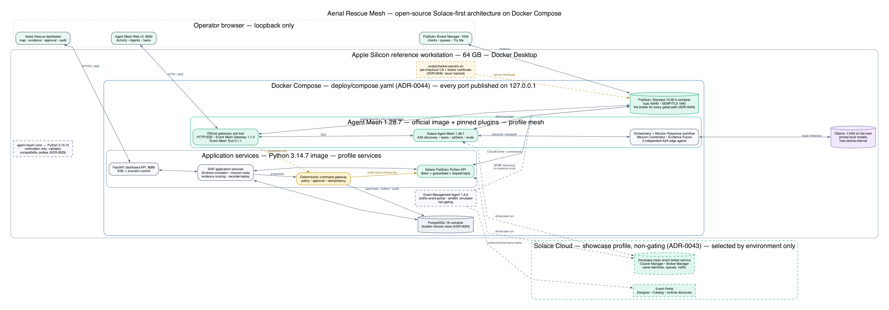
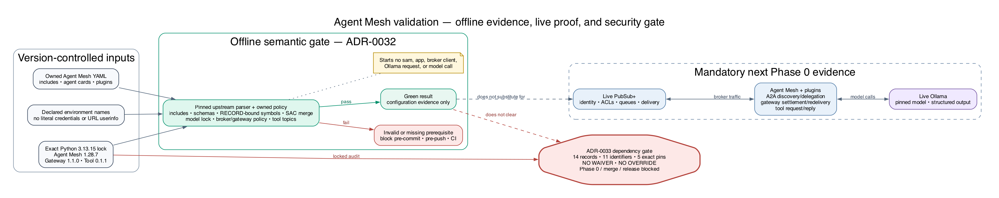

# Architecture

> **Authority:** this document is the single home for component responsibilities, the Solace-first policy, the runtime layout, and the operating modes. `docs/IMPLEMENTATION_PLAN.md` and
> `AGENTS.md` reference it and must not restate it ([ADR-0016](adr/0016-documentation-set-split.md)).
> Where this document and an `Accepted` ADR disagree, the ADR governs.
>
> **Related:** [ADR-0007](adr/0007-solace-first-implementation-policy.md) (Solace-first), [ADR-0001](adr/0001-self-hosted-open-source-agent-mesh.md) (self-hosted Agent Mesh), [ADR-0003](adr/0003-postgres-durable-mission-store.md) (durable store), [ADR-0004](adr/0004-split-python-runtimes.md) (split runtimes), [ADR-0043](adr/0043-docker-broker-with-solace-cloud-showcase.md) (broker substrate and showcase), [ADR-0044](adr/0044-docker-compose-runtime-with-official-agent-mesh-image.md) (Compose runtime), [ADR-0046](adr/0046-generated-local-certificate-authority.md) (local TLS), [ADR-0008](adr/0008-abstention-over-recorded-substitution.md) (degraded behaviour), [ADR-0009](adr/0009-isolated-side-effect-free-replay.md) (replay isolation). Interfaces are in [CONTRACTS.md](CONTRACTS.md); numbers in [operating-parameters.md](operating-parameters.md).

## Solace-first implementation policy

Use the largest practical set of supported open-source Solace building blocks before writing equivalent infrastructure. The initial architecture deliberately exercises:

- Agent Mesh A2A Agent Hosts, agent cards, discovery, delegation, Orchestrator, YAML workflows, artifact handling, HTTP/SSE gateway, and evaluation tooling.
- The official Event Mesh Gateway and Event Mesh Tool plugins, including Solace AI Connector expressions, transformations, structured invocation, correlation forwarding, request/reply, and explicit message settlement.
- The Solace PubSub+ Messaging API for Python for application-side direct messaging, guaranteed messaging, queue consumers, publisher confirmation, request/reply, reconnect handling, and trace-context propagation.
- The PubSub+ software event broker container for the shared A2A control plane and application data plane, isolated through namespaces, client identities, ACLs, queues, and subscriptions; the Developer-class Solace Cloud service is a non-gating showcase profile that carries the same traffic when selected by environment ([ADR-0043](adr/0043-docker-broker-with-solace-cloud-showcase.md)).

Project-owned code is reserved for the SAR scenario and simulator, strict domain validation, deterministic evidence scoring, mission state, the command/approval policy boundary, recording/replay isolation, and the operator dashboard. A new custom transport, agent runtime, gateway, connector, or broker abstraction requires a documented capability gap and a focused test proving why the official Solace component is insufficient.

| Solace component | Initial-release responsibility | Acceptance evidence |
| --- | --- | --- |
| Agent Mesh Agent Hosts and A2A | Agent discovery, task lifecycle, streaming updates, peer delegation | Web UI Agents/Activity plus correlated A2A broker traffic |
| Agent Mesh Orchestrator | Open-ended operator questions and unexpected replanning | Delegation evaluation and task trace |
| Agent Mesh YAML workflow | Deterministic mission-response sequence and typed agent steps | Structured input/output contract and repeatable workflow result |
| HTTP/SSE gateway | Upstream engineering task UI | Loopback health and streamed task result |
| Event Mesh Gateway 1.1.0 | Allowlisted salient-event ingress, transforms, structured invocation, response routing | Topic-to-task contract, deferred settlement, redelivery, success/error routes |
| Event Mesh Tool 0.1.1 | Read-only status and action-proposal request/reply | Correlation, timeout, malformed reply, and ACL-denial tests |
| PubSub+ Messaging API for Python | Application telemetry, guaranteed consumers, publisher confirmation, reconnect, request/reply | Real-broker integration and failure-injection suites |
| PubSub+ software event broker container | Shared broker, topic routing, queues, spool, ACL enforcement | Broker Manager clients/subscriptions/rates and queue-depth transition |
| Solace Cloud service (showcase) | The same identities, queues, and traffic on a Developer-class service, by environment only | Redacted Cluster Manager, Broker Manager, and Event Portal evidence ([ADR-0043](adr/0043-docker-broker-with-solace-cloud-showcase.md)) |
| Solace distributed-tracing integration | W3C trace propagation across publish/receive boundaries | One trace linked to A2A task, CloudEvent, proposal, and command IDs |

Editable source: [`docs/architecture/aerial-rescue-mesh-overview.dot`](architecture/aerial-rescue-mesh-overview.dot).

## Self-hosted Solace Agent Mesh

- **The PubSub+ broker container** carries application telemetry, mission events, evidence, commands, command results, and operator decisions.
- **Agent Mesh runtime 1.28.7** runs locally from a pinned package and uses the broker for A2A discovery, task requests, status updates, and responses.
- **Agent Mesh Orchestrator** discovers agents from their published agent cards and delegates mission-level work.
- **Mission Response workflow** defines the repeatable mission-start-to-proposal path in versioned Agent Mesh YAML. It invokes specialized agents through structured inputs and outputs while leaving all executable effects to the deterministic command gateway.
- **Mission Coordinator agent** translates operator intent and salient fleet events into search assignments and replanning decisions.
- **Evidence Fusion agent** correlates structured visual, thermal, positional, and contextual evidence.
- **Three edge agents** run as separately deployable Agent Mesh processes with distinct agent cards, Ollama models, capabilities, queues, and broker identities.
- **HTTP/SSE Web UI gateway** provides the upstream Agent Mesh chat/task surface on loopback for direct inspection of discovered agents and streamed task results.
- **Event Mesh Gateway 1.1.0** is the pinned official ingress plugin. It allowlists salient application topics, uses structured invocation and JSON Schemas where supported, translates events into A2A tasks, forwards correlation context, and routes success and failure outputs to non-authoritative result topics. Routine telemetry never enters this gateway.
- **Event Mesh Tool 0.1.1** is the pinned official request/reply plugin for read-only status queries and action proposals. Its broker identity can publish only to command-gateway request topics and cannot publish executable or authorized command topics.
- **The `general` and `planning` configurations** are supplied through LiteLLM-compatible model settings by either a paid provider (Anthropic or OpenAI) or local Ollama. Paid mode is the default for acceptance runs; local-only is a first-class, tested configuration so the system runs with no API key. Exactly one provider is active per run and readiness reports which. See [ADR-0002](adr/0002-paid-orchestration-under-enforced-budget-cap.md).

SAC YAML, agent cards, prompts, inline Ollama model dictionaries, gateway/tool configuration, and plugin declarations under `agent-mesh/` are the reproducible source of truth. Do not configure `model_provider`; in Agent Mesh 1.28.7 it takes precedence over the inline `model` dictionary and would move model authority into the local Platform database. The pinned `sam` CLI initializes, runs, and exercises these files; record exact validation commands only after confirming them from `sam --help` for 1.28.7. Secrets are injected only through ignored environment files or an approved secret store.

### Offline Agent Mesh configuration validation

[Editable Graphviz source](architecture/agent-mesh-validation-flow.dot)

The semantic-configuration gate [ADR-0032](adr/0032-agent-mesh-semantic-configuration-validator.md) requires is repository verification tooling, not a runtime component. It runs inside the isolated Python 3.13 environment and delegates what upstream already defines to the exact pinned wheels: include expansion, parsing, and multi-file merge to Solace AI Connector 3.3.12; agent and workflow `app_config` validation to Agent Mesh 1.28.7's own configuration models; and gateway `app_config` validation to the Event Mesh Gateway 1.1.0 schema. Every imported symbol is bound to its installed distribution record, so a substituted module fails closed. On top of that it enforces the owned rules: includes stay inside the repository; every credential and broker field is an environment reference declared in `.env.example`; broker URLs are `tcps`, or WSS on port 443, with no userinfo; `model_provider` is absent and model identifiers are exact; gateway handlers settle with the policy stated in [CONTRACTS.md](CONTRACTS.md) and route only to declared outputs; and the Event Mesh Tool is the pinned `sam_event_mesh_tool.tools:EventMeshTool`, using request/reply over JSON and publishing only to `aerial-rescue/v1/{{ missionId }}/gateway/request/{{ operation }}` with wildcard-free identifiers. Every selected file must be valid on its own; a multi-file run also merges them with the pinned merge primitive and fails on a conflict such as a duplicated app name. The gate starts no Agent Mesh process, broker client, application, Ollama request, or model call, and runs the upstream imports inside a temporary home directory so their import-time artifacts never touch the working tree. It is inert until an owned configuration exists, then fails closed on a missing prerequisite or an unreadable file. Where it refuses more than ADR-0032 states, [ADR-0035](adr/0035-refuse-unprovable-agent-mesh-configuration.md) records why.

A green result is configuration evidence only. Live PubSub+ and Ollama messaging is the next Phase 0 step: it must prove broker identity and ACL enforcement, A2A discovery and delegation, Event Mesh Gateway transformation, settlement and redelivery, Event Mesh Tool request/reply, and structured model output.

## Local Python components

- **Fleet simulator:** Adapts the deterministic scenario to broker and clock ports, drives the pure Tier 1
  domain state machines in `packages/domain` — mission, sector, command, drone connectivity, and evidence
  lifecycles ([ADR-0017](adr/0017-mutation-tool-score-and-risk-tiers.md)) — injects failures, publishes
  telemetry, and consumes commands.
- **Command gateway:** Owns deterministic mission-command policy, idempotency, proposal-bound approval checks, durable outbox state, and executable command publication. Agent credentials cannot bypass it.
- **Durable mission store:** PostgreSQL, run as a Docker Compose service, is the authoritative durable store for mission state, inbox/outbox records, proposals, approvals, idempotency results, evidence provenance, and audit records. Access is through async SQLAlchemy 2.x with `asyncpg`, and schema is managed with Alembic migrations. Broker acknowledgement occurs only after the related durable transaction commits. An append-only audit table with a monotonic ordinal is the ordering authority for the mission timeline. See [ADR-0003](adr/0003-postgres-durable-mission-store.md).
- **Broker adapter:** Wraps the Solace PubSub+ Messaging API for Python 1.11 (or an explicitly reviewed compatible patch) in the Python 3.14 application environment and isolates connection, publishing, subscription, acknowledgement, retry, and shutdown behavior. Agent Mesh keeps the separate PubSub+ client version resolved by its own lockfile.
- **Scenario service:** Loads versioned scenario definitions, applies a deterministic random seed, and exposes lifecycle operations.
- **Evidence service:** Validates model observations, attaches provenance and hashes, delegates score
  calculation to pure Tier 1 domain logic, and publishes the resulting versioned evidence decision. In a
  live simulation, model failure produces an explicit abstention or manual-review outcome; recorded
  evidence is never substituted.
- **Recorder/replayer:** Writes sanitized CloudEvents to NDJSON and replays the same events through the dashboard-facing interface.
- **Dashboard API:** FastAPI service providing scenario control, operator approval, health, readiness, and server-sent events.

All Python work runs in an isolated project virtual environment managed by `uv`:

- Application services use Python 3.14.7, the newest stable Python release, in the root `.venv` with the root `pyproject.toml` and `uv.lock`.
- Agent Mesh 1.28.7, the two official Event Mesh plugins, and any owned Agent Mesh extension use Python 3.13.15 in `agent-mesh/.venv` with `agent-mesh/pyproject.toml` and `agent-mesh/uv.lock`, because upstream declares `>=3.10.16,<3.14`.
- Shared Python packages consumed by both environments must declare and test the intersecting compatibility range. Never install either environment's dependencies globally or combine their lockfiles.

Use Debian/glibc-based Python containers rather than Alpine images for ARM compatibility with the Solace client.

The Solace Python library must not be hosted through Python's `multiprocessing` module. Independent Agent Mesh components and edge agents run as separate native processes on the supported Apple Silicon path. Host-run components access Ollama through `http://127.0.0.1:11434`; containerized application services use `http://host.docker.internal:11434`.

### Deployment layout

Every component except Ollama runs under Docker Compose from `deploy/compose.yaml`, and the compose policy gate holds that file to its policy on every commit ([ADR-0044](adr/0044-docker-compose-runtime-with-official-agent-mesh-image.md), [ADR-0045](adr/0045-fail-closed-compose-policy-gate.md)). Images are pinned by tag and index digest, every published port binds to `127.0.0.1`, secrets are files under the ignored `deploy/secrets/` mounted at `/run/secrets/`, and every service declares a healthcheck.

| Profile | Services | State |
| --- | --- | --- |
| default | `broker` (PubSub+ Standard 10.26.0), `postgres` (PostgreSQL 18.6) | Runnable; the only services with behaviour today |
| `mesh` | `agent-mesh`, built on the official `solace/solace-agent-mesh:1.28.7` image with the two pinned Event Mesh wheels installed by hash | Inert until the first configuration lands under `agent-mesh/configs/`, which is when it moves to the default profile |
| `services` | the six application services and the dashboard API, built from one Python 3.14.7 image | Inert: each command imports its package and exits, because no entrypoint exists yet |
| `event-portal` | the Event Management Agent for Event Portal runtime discovery, an amd64-only image run under emulation | Non-gating showcase support ([ADR-0043](adr/0043-docker-broker-with-solace-cloud-showcase.md)) |

Verification stays native: `agent-mesh/.venv` on Python 3.13.15 runs the configuration validator and the compatibility probes ([ADR-0029](adr/0029-verify-the-agent-mesh-domain-with-its-own-toolchain.md)), while the container, which carries upstream's Python 3.13.11, is the runtime. The plugin-compatibility probe must be run inside the built image before the `mesh` profile is declared supported. Ollama stays on the host; containers reach it as `http://host.docker.internal:11434`. The showcase profile is the same stack pointed at the Solace Cloud service through an ignored `.env.showcase`; no gate, hook, or release criterion depends on it.

`scripts/broker-secrets.sh` generates the per-checkout certificate authority, the broker's server certificate with subject alternative names for `localhost`, `broker`, and `127.0.0.1`, and the stack's passwords; `deploy/certs/` is the trust-store directory every client mounts, and `tcps` validation is never relaxed ([ADR-0046](adr/0046-generated-local-certificate-authority.md)).

The reference workstation, self-hosted Agent Mesh processes, and one Ollama daemon form a common failure and resource domain. Startup must warm models sequentially, inference concurrency must be bounded, and Phase 0 must record idle/peak CPU, unified memory, and model-load time. Resource exhaustion or model eviction yields an explicit degraded state and abstention; it must never cause an approval bypass or silently substitute recorded evidence.

## Local edge models

| Drone | Model | Responsibility |
| --- | --- | --- |
| `drone-vision-01` | `qwen3-vl:8b` | Analyze prepared wilderness images and return structured observations |
| `drone-navigation-02` | `qwen3:4b` | Assess local route, terrain, battery, and sector-replanning options |
| `drone-comms-03` | `llama3:8b` | Summarize evidence and create concise degraded-link reports |

Model tags, Ollama version, prompt version, generation parameters, and resolved model digests must be recorded. Model responses are untrusted input and must pass Pydantic validation before becoming domain events.

The Agent Mesh `general` and `planning` configurations are selected in Phase 0 rather than assuming an edge-role model is adequate for orchestration. Candidates — at least one paid model per permitted provider and one local model — must pass fixed evaluations for agent discovery, delegation, tool calling, JSON-Schema-constrained output, latency, memory use, and cost per run. Phase 0 measures the paid and local-only configurations both, so the capability gap between them is recorded evidence rather than an assumption. The selected aliases then pin the exact model identifier and, for a local model, the resolved Ollama digest, plus context window, token cap, temperature, seed where supported, and timeout; no floating `latest` tag is allowed.

## Dashboard

The browser dashboard contains:

- A MapLibre map with the search polygon, sectors, trails, candidate locations, and rescue marker.
- A fleet panel showing agent type, connectivity, battery, assignment, model, and status.
- A mission timeline containing domain events, commands, retries, approvals, and Agent Mesh responses.
- An evidence panel showing image provenance, model observations, evidence-score contributors,
  corroboration, abstention, and rejection reasons.
- An operator command area for mission creation and approved actions.
- A prominent human-approval gate for rescue escalation.
- A live-simulation/degraded-live-simulation/replay badge that cannot be hidden or confused.
- Health indicators for the broker, the Agent Mesh container, Ollama, and the local services.

The dashboard uses React and TypeScript with Vite. Server-to-browser updates use SSE; operator actions use JSON HTTP requests. The UI must remain usable at the reference MacBook's normal resolution and must not rely on browser developer tools.

## Solace operational surfaces

The project deliberately exercises and exposes both Solace layers:

- **Open-source Agent Mesh Web UI (`localhost:8000` by default):** use the per-request Activity viewer and `Agent Mesh > Agents` registry/topology to inspect tasks, discovered agents, delegation, streamed responses, and artifacts. This is an engineering surface; it is not the authoritative mission dashboard and cannot approve or dispatch an action.
- **Solace PubSub+ Broker Manager** (`https://localhost:1943` on the container; the browser warns until the per-checkout authority is trusted)**:** show separately named Agent Mesh, gateway, command, simulator, edge-agent, recorder, and dashboard clients; inspect A2A and application topic subscriptions; observe ingress/egress rates; inspect guaranteed queue state; and use Try Me with the scoped A2A namespace during diagnostics.
- **Aerial Rescue Mesh dashboard:** show normalized mission state, evidence provenance, command lifecycle, human approval, and the cross-system audit identifiers that link a domain event to an A2A task and executable command.

The disconnect/reconnect acceptance flow must make Solace's role visible in Broker Manager: an offline drone's durable command queue changes from depth `0` to `1`, then returns to `0` only after reconnect, durable processing, and acknowledgement. Separately, Agent Mesh agent cards and task traffic prove dynamic discovery and A2A delegation over the broker. Screenshots may document these checks only after tenant-specific values and credentials are redacted.

Reserve and document loopback-only development ports to avoid collisions: Agent Mesh initialization/configuration UI `5002`, Agent Mesh runtime Web UI `8000`, project dashboard `5173`, project API `8080`, and Ollama `11434`. The initialization UI is a setup surface, not an operational monitoring surface. Production-like local startup may serve the built dashboard through the API and omit the Vite port. The compose stack publishes, on `127.0.0.1` only, 55443 and 1943 for the broker, 5432 for Postgres, 8000 for the Agent Mesh Web UI, 8080 for the dashboard API, and 8180 for the Event Management Agent; the broker's own 8080 and 8000 are never published, which is how they coexist with the reservations above ([ADR-0044](adr/0044-docker-compose-runtime-with-official-agent-mesh-image.md)).

## Observability and operating modes

Every service exposes liveness and readiness. Agent Mesh readiness is composite: the expected processes are running, the Web UI gateway is healthy, all required agent cards are discovered, the Event Mesh Gateway data-plane subscription is active, Ollama reports the pinned models, the broker is connected, and a bounded black-box A2A probe succeeds. A Web UI HTTP 200 alone is not readiness. Logs are structured and correlated. Metrics must cover event counts, publish/consume failures, retry counts, queue delay, model duration, validation failures, abstention/degraded-mode activation, SSE clients, and mission state.

Supported modes are:

- **Live simulation:** the PubSub+ container, Agent Mesh from its official image, live Python simulators, and local Ollama execute the synthetic scenario; the showcase profile runs the same mode against the Solace Cloud service ([ADR-0043](adr/0043-docker-broker-with-solace-cloud-showcase.md)).
- **Degraded live simulation:** Telemetry, the dashboard, and bounded operator control remain available when Agent Mesh or Ollama is unavailable; model-dependent work abstains or awaits manual review, and no recorded positive evidence enters the result.
- **Replay:** A committed sanitized NDJSON stream, carrying a format version header, drives an isolated, side-effect-free dashboard adapter. Isolation is structural rather than credential-scoped: a run-mode value injected at the composition root causes the broker publisher, model client, approval-store writer, and escalation executor to refuse construction, so no publish path exists to misuse. Replay credentials hold no publish grant either, and the UI makes no claim that agents are executing ([ADR-0009](adr/0009-isolated-side-effect-free-replay.md)).

The dashboard must always display the current mode.
