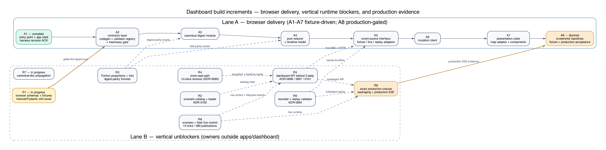

# Dashboard Build Guide

This document has one job: how `apps/dashboard` moves from its committed, deliberately red browser
acceptance contract to a green product surface, together with the contract and service work that
unblocks it. It owns the build increments, the increment-to-blocker join, and the browser module
composition. Every other fact is a reference to its canonical owner.

## 1. Authority and scope

[`IMPLEMENTATION_PLAN.md`](IMPLEMENTATION_PLAN.md) owns the delivery sequence, milestones, and
release criteria; the increments below elaborate its dashboard work and decide nothing above it.
Where this document and an Accepted ADR, [`IMPLEMENTATION_PLAN.md`](IMPLEMENTATION_PLAN.md), or any
canonical owner in the [`AGENTS.md`](AGENTS.md) table disagree, the canonical owner governs and this
document is defective; the stricter statement governs until an ADR resolves the conflict.

The dashboard-slice records
([ADR-0094](adr/0094-validate-replay-before-browser-playback.md) through
[ADR-0101](adr/0101-order-dashboard-events-outside-the-five-field-projection.md)) and the frontend
verification record
([ADR-0103](adr/0103-adjudicate-dashboard-coverage-and-separate-browser-evidence.md)) postdate passages
of [`CONTRACTS.md`](CONTRACTS.md), [`ARCHITECTURE.md`](ARCHITECTURE.md), and
[`operating-parameters.md`](operating-parameters.md). ADR-0102 separately constrains the normal startup
path that R9 must preserve. Until register row R7 in section 7 is worked off, those Accepted records
govern over the stale passages they supersede.

## 2. Where the build starts from

The active completion worktree forked clean `main` at `24037c7`; A1 is part of that base and became
green there on 2026-08-24:

- The browser acceptance contract is committed and remains red beyond the A1 shell on purpose. The
  Playwright specifications under `apps/dashboard/tests/e2e/` pin the complete operator surface —
  landmarks, live regions, exact strings, fleet-table ordering, timeline ordering, keyboard and axe
  behavior, visual baselines, and a zero-remote-request rule — before any application source exists. The contract's
  scope and honesty rules are fixed by
  [ADR-0098](adr/0098-make-the-wilderness-dashboard-ui-first.md); its local law is
  [`apps/dashboard/AGENTS.md`](../apps/dashboard/AGENTS.md) and its inventory is described in
  [`apps/dashboard/README.md`](../apps/dashboard/README.md) and the
  [`CHANGELOG.md`](../CHANGELOG.md) unreleased entry.
- The runtime and stack are pinned by [ADR-0099](adr/0099-pin-the-dashboard-runtime-and-stack.md),
  and the manifest, lockfile, and strict toolchain configuration are committed. A1 replaced the
  invalid `main` host with a neutral root, loads the real entry module, renders sibling banner and
  main landmarks, acknowledges the fixture revision after render, and keeps the complete unit
  coverage command green. The remaining browser acceptance cases still specify unimplemented
  A2-A8 behavior.
- The test harness fakes only serialized boundary inputs
  ([`dashboard-harness.ts`](../apps/dashboard/tests/e2e/support/dashboard-harness.ts)), and the
  start and reset requests are intercepted on the wire by the specifications themselves. A1-A7 can
  therefore be implemented and reviewed without a running backend. A8 waits for the production sources
  and packaged runtime blockers named below.
- The services the live surface will talk to are typed scaffolds with no implementation:
  [`services/dashboard_api`](../services/dashboard_api/AGENTS.md),
  [`services/scenario_service`](../services/scenario_service/AGENTS.md), and
  [`services/recorder`](../services/recorder/AGENTS.md).
- R1's browser-facing 19-shape schema, manifest, and fixture subincrement is green against the
  intended-red inventory begun at `f29d543` and its bounded-input extension in
  [`test_dashboard_wire_contracts.py`](../tests/contract/test_dashboard_wire_contracts.py). R1 still
  owes the catalog and scenario-definition documents, eight internal scenario/fleet start, status,
  cancel, and refusal shapes, strict service-owned Pydantic twins, and HTTP/OpenAPI expectation
  registries before A2 may start. The browser-facing values in
  [`dashboard-fixtures.ts`](../apps/dashboard/tests/e2e/support/dashboard-fixtures.ts) remain a
  test-side reference, not a production contract.
- [`view.py`](../packages/contracts/src/aerial_rescue_contracts/view.py) projects one event kind,
  and no reduced-state fold exists in Python;
  [`audit.py`](../packages/store/src/aerial_rescue_store/audit.py) writes the ordinal but exposes
  no read path; the `scenarios/` catalog directory that
  [ADR-0100](adr/0100-commit-a-strict-wilderness-scenario-catalog.md) fixes does not exist.

## 3. The governing decisions

- [ADR-0057](adr/0057-typescript-strictness-baseline-before-the-dashboard.md) — the strict
  TypeScript, lint, coverage, and manifest gates, enforced by
  [`typescript_policy_gate.py`](../tools/typescript_policy_gate.py).
- [ADR-0058](adr/0058-validate-dashboard-inputs-against-the-committed-schemas.md) — generated
  contract types, runtime JSON Schema validation, and the freshness gate the generated artifacts
  are owed.
- [ADR-0094](adr/0094-validate-replay-before-browser-playback.md) — replay bundles validated in an
  isolated one-shot container before browser playback.
- [ADR-0095](adr/0095-persist-only-the-ui-slice-lifecycle.md) — the persistence scope of the UI
  slice, bounded reset cancellation, and history-preserving reset.
- [ADR-0096](adr/0096-relay-the-dashboard-over-caddy-and-a-unix-socket.md) — Caddy as the sole
  host publisher, the API on a Unix socket, and the bootstrap shell that delivers the bearer.
- [ADR-0097](adr/0097-close-the-ui-slice-http-contract.md) — the closed route set, wire modes,
  refusal order, and idempotency-key form; there is no approval route in this slice.
- [ADR-0098](adr/0098-make-the-wilderness-dashboard-ui-first.md) — the UI-first slice: its
  workflow, viewport, fleet composition, declared-only labeling, state vocabulary, and
  zero-remote-request rule.
- [ADR-0099](adr/0099-pin-the-dashboard-runtime-and-stack.md) — every runtime, dependency, and
  tool pin.
- [ADR-0100](adr/0100-commit-a-strict-wilderness-scenario-catalog.md) — the committed scenario
  catalog and its strict loader.
- [ADR-0101](adr/0101-order-dashboard-events-outside-the-five-field-projection.md) — ordered
  dashboard events, the reducer's ordinal discipline, the three SSE frames, opaque cursors, and
  browser digest recomputation, ordered by the
  [ADR-0088](adr/0088-order-the-mission-timeline-by-a-per-mission-audit-ordinal.md) audit ordinal.
- [ADR-0102](adr/0102-start-the-agent-mesh-with-the-default-profile.md) — Agent Mesh remains part of
  normal default startup; R9 must isolate mission-control by selecting an exact service closure rather
  than by changing that default.
- [ADR-0103](adr/0103-adjudicate-dashboard-coverage-and-separate-browser-evidence.md) — independent
  dashboard coverage adjudication plus separate deterministic integration, fixture acceptance,
  service-integration, and production end-to-end evidence.
- [ADR-0104](adr/0104-bound-dashboard-schema-strings-and-arrays-explicitly.md) — the two additional
  cross-language schema assertions needed for nonempty strings and bounded or exact arrays.

## 4. Build increments

Definition of done, identical for every increment: the dashboard hook stages and CI pass
([`CONTRIBUTING.md`](../CONTRIBUTING.md)); the test classes that bind the increment pass
([`TESTING.md`](TESTING.md)); the phase evidence lands
([`IMPLEMENTATION_PLAN.md`](IMPLEMENTATION_PLAN.md), Phase 3). An increment does not start until
its entry criteria are met, and when a register row in section 7 is open, the browser builds
against the committed fixtures behind the eventual interface and never drafts the missing contract
itself.

**The join.** R1 gates A2, and A2's generated types are what A4 through A7 consume — so R1 gates
the entire typed core of Lane A, not merely A2. A1 alone precedes R1; its bootstrap-input
validation hardens in A2. Fixture-driven implementation and adapter tests through A7 need no running
backend. Live wiring — real SSE, real HTTP responses, and real replay bundles — waits on R5 and R6;
production A8 evidence also waits on R8 and R9.

### Lane A — the browser (`apps/dashboard/src`)

- **A1 — entry point and application shell.** *Status: complete at `24037c7`.*
  [`index.html`](../apps/dashboard/index.html) now provides a neutral root, and the real entry module
  renders sibling banner and `main` landmarks, the explicit mode badge, the dashboard-state live
  region, and post-render fixture revision acknowledgement. Unit and HTML-entry integration tests
  measure the hand-written bootstrap rather than excluding it; the full coverage command is green.
- **A2 — contracts layer.** *Status: not started. Blocked by R1.* The generation script, the
  offline validator registry compiled from the committed schemas, generated types under
  `apps/dashboard/src/contracts/generated/`, and the freshness gate
  [ADR-0058](adr/0058-validate-dashboard-inputs-against-the-committed-schemas.md) still owes, with
  its conformance test beside the other gate tests under `tools/quality_gate_tests/`.
- **A3 — canonical digest module.** *Status: not started.* The browser twin of the
  [`CONTRACTS.md`](CONTRACTS.md) canonical serialization and digest, using the platform crypto
  API; its parity oracle arrives with R3.
- **A4 — pure reducer and timeline model.** *Status: not started.* The
  [ADR-0101](adr/0101-order-dashboard-events-outside-the-five-field-projection.md) ordinal
  discipline — successor accepted, exact duplicate ignored, gap, regression, and digest divergence
  refused with the alert phrasings the specifications pin — plus the timeline as an append model
  that telemetry never enters.
- **A5 — event-source interface and adapters.** *Status: not started.* One interface, three
  adapters — the test-fixture source, the live SSE source, and the replay-bundle source — with
  explicit disposal, and the stream-overloaded control frame answered by exactly one
  resynchronization. Live wiring waits on R5; replay bundles wait on R6.
- **A6 — mutation client.** *Status: not started.* The in-memory-only bearer, the idempotency-key
  form and refusal handling [ADR-0097](adr/0097-close-the-ui-slice-http-contract.md) fixes, a
  double-submit guard that survives two synchronous activations, and a reload control that
  performs a real document navigation.
- **A7 — presentation state, map, and components.** *Status: not started.* Presentation state —
  filters, selection, rail collapse, layer toggles, playback cursor and speed, marker
  interpolation — held outside mission state and its digest; the map adapter over the pinned
  renderer with an empty local style and committed geometry; and the components the
  specifications name: scenario rail, fleet rail with its semantic table, timeline, drone detail,
  reset dialog, and replay controls.
- **A8 — screenshot baselines and final acceptance.** *Status: not started. Blocked by R5, R6, R8,
  and R9.* Generate baselines last, at both configured viewports, only after the coherent interface
  has been visually inspected and the real production sources work through the packaged service
  closure. The full fixture acceptance inventory and the separate production end-to-end execution
  must then be green.

### Lane B — the vertical unblockers

- **R1 — dashboard wire-shape schemas.** *Status: in progress. Browser schema/fixture subincrement is
  green from the intended-red contract commits beginning at `f29d543`. Owners: `schemas/`, `services/dashboard_api`,
  `services/scenario_service`, and `services/fleet_simulator`.* The browser-facing inventory now has an
  exact 19-shape contract under [`test_dashboard_wire_contracts.py`](../tests/contract/test_dashboard_wire_contracts.py):
  closed schemas, manifest ownership, polarity pairs, integer scenario revision, sector authority,
  ordered-event timelines, operation-state separation, and replay integrity. It remains blocked until
  the catalog/definition and eight internal-control shapes, strict service-owned Pydantic models, and
  HTTP/OpenAPI expectation registries land. `packages/contracts` remains the owner of the pure Python
  projections and fold in R3 and does not take a Pydantic dependency. ADR-0094/0097/0100/0101 decide the
  shapes; the e2e fixture is a reference, never the type authority. R1 remains the single prerequisite
  for A2 and everything after it.
- **R2 — scenario catalog and loader.** *Status: not started. Owner: `services/scenario_service`.*
  The two committed catalog files and the strict loader
  [ADR-0100](adr/0100-commit-a-strict-wilderness-scenario-catalog.md) fixes.
- **R3 — Python contract twins.** *Status: not started. Owner: `packages/contracts`.* The missing
  projections, the ordered-event wrapper, the reduced-state fold and state document, the first
  real use of the replay-state digest context, and the Python-and-TypeScript digest-parity
  fixtures that make A3 and A4 provable.
- **R4 — store read path.** *Status: not started. Owner: `packages/store`.* The ordered
  non-telemetry timeline read, the latest-ordinal read, and the cursor suffix behind the
  [ADR-0095](adr/0095-persist-only-the-ui-slice-lifecycle.md) persistence revision.
- **R5 — dashboard API.** *Status: not started. Owner: `services/dashboard_api`.* The application
  behind Caddy on the Unix socket, the closed route set, the bootstrap shell, the SSE frames, and
  bounded reset cancellation
  ([ADR-0096](adr/0096-relay-the-dashboard-over-caddy-and-a-unix-socket.md),
  [ADR-0097](adr/0097-close-the-ui-slice-http-contract.md),
  [ADR-0101](adr/0101-order-dashboard-events-outside-the-five-field-projection.md)).
- **R6 — recorder and replay validation.** *Status: not started. Owner: `services/recorder`.* The
  recording, the isolated replay validator, and the replay-bundle route
  ([ADR-0094](adr/0094-validate-replay-before-browser-playback.md)).
- **R7 — canonical-document propagation.** *Status: in progress. Owner: each document's
  maintainer.* The verification facts now reach [`TESTING.md`](TESTING.md),
  [`operating-parameters.md`](operating-parameters.md), the root and dashboard README files,
  [`CHANGELOG.md`](../CHANGELOG.md), and the relevant dashboard, script, and tool agent guidance.
  Remaining propagation includes the [`CONTRACTS.md`](CONTRACTS.md) route and event-stream sections;
  the [`ARCHITECTURE.md`](ARCHITECTURE.md) dashboard, port, mode, and runtime sections; the broader
  [`IMPLEMENTATION_PLAN.md`](IMPLEMENTATION_PLAN.md) runtime decisions, repository shape, milestones,
  and release gates; [`LIMITATIONS.md`](LIMITATIONS.md); security documentation; deployment guidance
  and local runbooks; later component-specific agent guidance; and the ADR-0067 index row, whose
  successor still disagrees with the record.
- **R8 — scenario and fleet live control.** *Status: not started. Owner:
  `services/scenario_service` and `services/fleet_simulator`.* Add the authenticated private HTTP
  control surface, exact 20-simulation projection, bounded pacing and cancellation, guaranteed
  connectivity and sector transitions, and the 14-tick/280-publication proof and separate publication
  counter defined in
  [`operating-parameters.md`](operating-parameters.md#workload-and-service-level-profile).
- **R9 — production packaging and exact service selection.** *Status: not started. Owner:
  `deploy/`, `services/dashboard_api`, and `justfile`.* Preserve
  [ADR-0102](adr/0102-start-the-agent-mesh-with-the-default-profile.md) for normal startup while
  adding the explicit mission-control service closure, replay-validator isolation, Unix-socket
  relay, security headers, asset policy, health checks, and production end-to-end entry point.

## 5. Browser state architecture

Three state owners, separated by rule ([ADR-0098](adr/0098-make-the-wilderness-dashboard-ui-first.md),
[`apps/dashboard/AGENTS.md`](../apps/dashboard/AGENTS.md)), with a one-way dependency direction:

1. **Server state** — transport status, retry schedule, bearer validity, and the latest typed
   refusal. It owns nothing mission-shaped, and refusals land here so the operator can see what
   the browser could not accept.
2. **Mission state** — written only by the pure reducer over validated ordered events, or replaced
   wholesale by a validated snapshot. The digest is recomputed after every accepted event and
   divergence fails closed while the last validated state stays visible
   ([ADR-0101](adr/0101-order-dashboard-events-outside-the-five-field-projection.md)).
3. **Presentation state** — the timeline (appended from the validated event stream, ordered by
   audit ordinal, never reconstructed from the reduced snapshot), map viewport, filters,
   selection, panel and playback state. None of it enters mission state or its digest.

The data flow is fixed: boundary input → canonical decode and schema validation → typed value →
reducer or timeline append → render. Every adapter implements the one event-source interface, so
live SSE, validated replay bundles, and deterministic test fixtures feed the same reducer.

## 6. Verification

- Each Lane A increment lands with the unit, component, deterministic integration, and contract coverage
  [`TESTING.md`](TESTING.md) assigns, under its structure rules for TypeScript tests; the
  acceptance suite is the property of the whole lane and goes green at A8.
- The blocking browser wrapper
  [`dashboard-playwright-full.sh`](../scripts/hooks/dashboard/dashboard-playwright-full.sh)
  enforces the pinned runtimes, the manifest-owned test inventory, the cached browser build, and
  the bearer-sentinel scan; the complete coverage wrapper is
  [`dashboard-test-full.sh`](../scripts/hooks/dashboard/dashboard-test-full.sh). The latter emits a
  temporary JSON summary that the independent gate selected by
  [ADR-0103](adr/0103-adjudicate-dashboard-coverage-and-separate-browser-evidence.md) adjudicates,
  while
  [`dashboard-integration-full.sh`](../scripts/hooks/dashboard/dashboard-integration-full.sh)
  separately proves the dedicated integration inventory is non-empty. Playwright coverage is never
  merged into that package result.
- The 64 fixture-driven Playwright cases are browser acceptance, not production-stack end-to-end
  evidence. R9 adds the separate production execution only after R5, R6, and R8 are green.
- A new untracked file must be passed to the pre-commit hooks explicitly before staging
  ([`AGENTS.md`](AGENTS.md) section 6); diff-based discovery cannot see it.

## 7. Blocker and staleness register

| Row | Blocked dashboard work | Missing today | Owner |
| --- | --- | --- | --- |
| R1 | A2, and through it the typed core A4-A7 | remaining scenario/internal schemas, service-owned Pydantic twins, and HTTP/OpenAPI expectations | `schemas/`, dashboard/scenario/fleet services |
| R2 | live scenario listing and start data | catalog files and strict loader | `services/scenario_service` |
| R3 | digest and reducer parity proof for A3-A4 | projections, ordered-event wrapper, Python fold, parity fixtures | `packages/contracts` |
| R4 | snapshot timeline and resume reads | store read path, persistence revision | `packages/store` |
| R5 | live SSE and HTTP in A5-A6 | the API, Caddy relay, bootstrap shell, SSE frames | `services/dashboard_api` |
| R6 | replay bundles in A5 and A8 replay flows | recording, validator, bundle route | `services/recorder` |
| R7 | none directly; removes contradictions readers hit | remaining canonical-document, security, deployment, runbook, and ADR-index propagation | each document's maintainer |
| R8 | live runtime behavior behind A5-A8 | authenticated scenario/fleet control, exact publications, guaranteed lifecycle events | `services/scenario_service`, `services/fleet_simulator` |
| R9 | production-source A8 evidence and isolated local delivery | exact service closure, replay isolation, Caddy/socket packaging, production E2E | `deploy/`, `services/dashboard_api`, `justfile` |

## 8. Maintaining this document

- When a fact stated here gains a canonical owner — a schema lands, a record is accepted, a number
  enters [`operating-parameters.md`](operating-parameters.md) — delete the statement and replace
  it with a link in the same change.
- Update each increment's status line in the change that moves it, and refresh the dated claims in
  section 2 whenever they are touched.
- The repository moves concurrently; verify every claim in section 2 against the current commit
  before editing this document.
